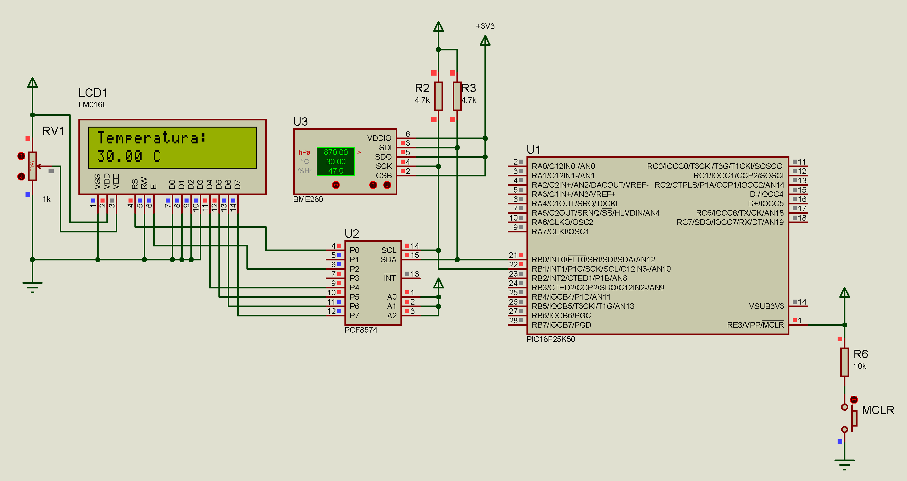

# Sistema de Monitoramento Ambiental com BME280

Este projeto implementa um sistema de monitoramento ambiental utilizando o sensor BME280 em conjunto com um microcontrolador PIC18F25K50. O sistema realiza medições de temperatura, umidade e pressão atmosférica, exibindo os dados de forma rotativa em um display LCD I2C.



## 🚀 Características

- Leitura de temperatura com precisão de 0.01°C
- Leitura de umidade com precisão de 0.008%
- Leitura de pressão atmosférica com precisão de 0.18Pa
- Display rotativo em LCD I2C
- Comunicação I2C para sensor e LCD
- Atualização automática a cada 2 segundos
- Interface amigável no display LCD
- Múltiplos modos de operação (Normal, Forçado e Sleep)
- Filtro digital configurável
- Tempo de standby ajustável

## 📋 Pré-requisitos

### Software
- mikroC PRO for PIC v7.6.0 (edição, compilação e debug do código fonte)
- Proteus v8.16 (para simulação)

### Hardware necessário:
- PIC18F25K50
- Sensor BME280
- Display LCD com módulo I2C
- Fonte de alimentação 5V
- Resistores pull-up para I2C (4.7kΩ)

## 🔧 Conexões

### Pinagem do PIC16F887:
- RB0 (SDA) -> SDA do BME280 e LCD
- RB1 (SCL) -> SCL do BME280 e LCD
- VDD -> 5V
- VSS -> GND

### Pinagem do BME280:
- SDA -> SDA do PIC (Necessario de um Logic Level Converter)
- SCL -> SCL do PIC (Necessario de um Logic Level Converter)
- VDD -> 3.3V
- GND -> GND
- CSB -> VDD (para modo I2C)
- SDO -> Configuração do endereço I2C (GND = 0xEC, VDD = 0xEE)

## 📁 Estrutura do Projeto

```
BME280-Environmental-Monitor/
├── src/
│   ├── main.c
│   ├── BME280_With_PIC18F25K50.hex
│   ├── BME280_With_PIC18F25K50.cfg
│   ├── BME280_With_PIC18F25K50.mcppi
│   └── bibis/
│       ├── lcd_i2c.c
│       ├── lcd_i2c.h
│       ├── bme280.c
│       └── bme280.h
├── img/
│   └── circuit.png
├── simulation/
│   └── BME280_With_PIC18F25K50.pdsprj
├── doc/
│   ├── manual_mikroC-v101.pdf
│   ├── datasheet_bme280.pdf
│   └── datasheet_pic16f887.pdf
├── .gitignore.md
├── license.md
└── readme.md
```

## 🛠️ Compilação e Simulação

1. Clone o repositório:
```bash
git clone https://github.com/genlicos/BME280-With-PIC18F25K50.git
```

2. Abra o arquivo `src/BME280_With_PIC18F25K50.mcppi` no mikroC PRO for PIC v7.6

3. Compile o projeto:
   - Faça as devidas modificações de sua preferência
   - Build o projeto (Ctrl+F9)
   - Firmware gerado `src/BME280_With_PIC18F25K50.hex`

4. Para simulação:
   - Abra o arquivo `simulation/BME280_With_PIC18F25K50.pdsprj` no Proteus
   - Execute a simulação

## 📄 Configuração Inicial

O código já vem com uma configuração inicial que pode ser modificada alterando os valores no arquivo `src/main.c`:

```c
// Configuração do sensor
BME280_Begin(MODE_NORMAL,         // Modo de operação
             SAMPLING_X1,         // Oversampling temperatura
             SAMPLING_X1,         // Oversampling umidade
             SAMPLING_X1,         // Oversampling pressão
             FILTER_OFF,          // Filtro digital
             STANDBY_0_5);        // Tempo de standby
```

## ⚡ Características Técnicas

1. **Comunicação I2C**
   - Velocidade de comunicação: 100kHz
   - Pull-up resistor: 4.7kΩ
   - Endereço do BME280: 0xEC ou 0xEE (configurável)
   - Endereço do LCD: 0x4E

2. **Display LCD**
   - Interface I2C
   - 2 linhas x 16 caracteres
   - Atualização: 2 segundos
   - Exibição rotativa das medições

3. **Sensor BME280**
   - Faixa de temperatura: -40 a +85°C
   - Faixa de umidade: 0 a 100%
   - Faixa de pressão: 300 a 1100 hPa
   - Precisão de temperatura: ±1°C
   - Precisão de umidade: ±3%
   - Precisão de pressão: ±1 hPa

## 🌡️ Funcionamento

1. Na inicialização:
   - Configura comunicação I2C
   - Inicializa LCD
   - Verifica conexão com sensor
   - Configura e inicializa BME280
   
2. Em operação:
   - Realiza leituras periódicas do sensor
   - Processa dados com compensações de calibração
   - Exibe valores no display de forma rotativa
   - Alterna entre temperatura, umidade e pressão a cada 2 segundos

## 🤝 Contribuindo

1. Faça um Fork do projeto
2. Crie uma Branch para sua modificação (`git checkout -b feature/AmazingFeature`)
3. Commit suas mudanças (`git commit -m 'Add some AmazingFeature'`)
4. Push para a Branch (`git push origin feature/AmazingFeature`)
5. Abra um Pull Request

## 📝 Licença

Este projeto está sob a licença MIT - veja o arquivo [LICENSE](license) para detalhes

## ✒️ Autor

* **Elison Nogueira** - *Trabalho Inicial* - [genlicos](https://github.com/genlicos)

## 🎁 Expressões de gratidão

* Compartilhe este projeto 📢
* Me Convide para uma cerveja 🍺 
* Um agradecimento publicamente 🤝